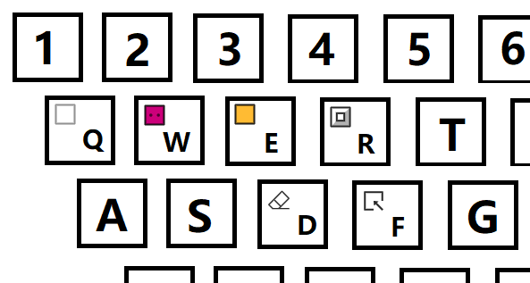

# Patrick's Parabox Editor

> A level editor for [Patrick's Parabox](https://www.patricksparabox.com/)

## Website

https://kenton1989.github.io/pp-editor/

## Keyboard Shortcuts

| Key              | Function                               |
| ---------------- | -------------------------------------- |
| ctrl/cmd+z       | undo                                   |
| ctrl/cmd+shift+z | redo                                   |
| ctrl/cmd+shift+s | save as .txt                           |
| ctrl/cmd+alt+s   | save as .json                          |
| f                | use "Select" brush                     |
| d                | use "Erase" brush                      |
| r                | use "Wall" brush                       |
| e                | use "Box" brush                        |
| w                | use "Player" brush                     |
| q                | use "Floor" brush                      |
| 1 - 9            | use 1 - 9th block as "Reference" brush |

The layout of brushes is like:

## Useful Links

Official Customized Level Manual: [link](https://www.patricksparabox.com/custom-levels/)

## Q&A

### Save .json vs. Save .txt

- save as .txt file
  - .txt level file is the file use by Patrick's Parabox.
  - To play a customized level, you must save the level into .txt file, and load it into the game according to the [official manual](https://www.patricksparabox.com/custom-levels/#load).
- save as .json file
  - .json file is like a project file used by this editor only.
  - It cannot be loaded into Patrick's Parabox.
  - It contain's more information than .txt file to facilitate editing. These info will be erased when you save the level in to a .txt file.
  - The extra information includes:
    - the name of level
    - the name of each blocks
- In general, you can just save as .txt file, unless you really care about the extra information contained in .json file.